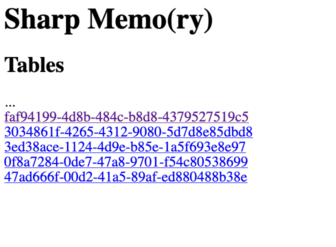
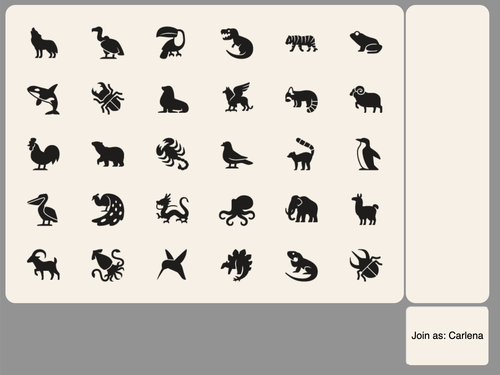

# SharpMemo (C# Memory Game)

This repo contains prototype of Memory Game. This Game was created with single purpose of me learning C#/Dotnet 

Currently, server side is C# and UI implemented using JS + jQuery. As a next step, I am planing to reimplement UI with C# 
(using [Blazor](https://dotnet.microsoft.com/apps/aspnet/web-apps/client)).

## How to build

```bash
./Scripts/build.sh
``` 

## How to run

```bash
./Scripts/run.sh
```

## How to test

```bash
./Scripts/test-postman.sh 
```
**NOTE** You need to have `newman` [installed](https://www.npmjs.com/package/newman#installation) in order to run tests

**NOTE** Tests are repeatable. You can run it over and over again.

## How to play

The game can be played in single-player of multi-player way

### Single Player 

- Open `http://localhost:8000/index.html` in the browser of your choice. 
- Select one of the tables from the list.

- Click [Join as \<name>] button in right bottom corner (\<name> should appear in the list of players on the right)

- Game consist of rounds
- Successful end of round marked with background blinking green
- Failure marked with background blinking red (and your name removed from the list of players)
- To complete first round, select any animal
- In all consecutive rounds your goal is to try to select all the animals from previous rounds in correct order 
and than select one more animal. (For example, if you choose scorpion in first round, 
in second round you should choose scorpion again and than you can choose other animal to complete second round. 
If you choose dragon as a second animal, than in third round you will have to select scorpion than dragon and than one more animal...) 

### Multi Player

The only difference, more than one player can join at the same time and each player have to select all the animals selected 
in previous rounds by all the players and if s/he succeed thant s/he can select one more animal.

Watch [this video](./Documentation/sharp-memo-play.mov) to get the idea how it works.

## How to build Docker container

```bash
./Scripts/build-docker.sh
```

**NOTE** In current form, Docker image weight about 200MB


## How to run Docker container

to start:

```bash
./Scripts/start-docker.sh
```

to stop:

```bash
./Scripts/stop-docker.sh
```
